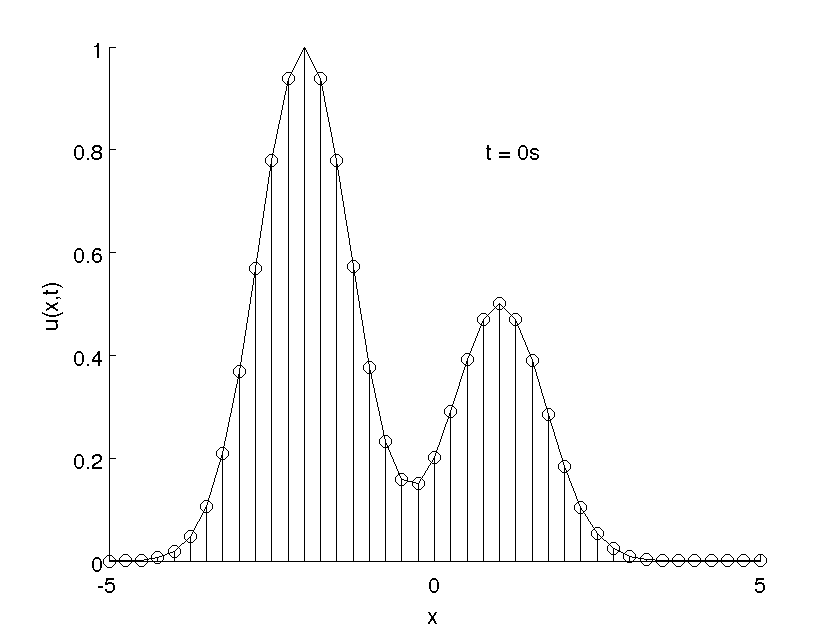

# CX/MATH 4640 Final Project

## What your report should contain

__In your own words.__

* An appropriate explanation of the key points of the topic (see "Audience" below)

* Description of methods used to solve the problem
	* Algorithms you learned! And perhaps some we didn't have time to go over.

* When the methods fail and when they do well
	* For example, conditioning can play a role here.

* Examples of edge cases or special cases of the problem. 
	* For example, solving banded matrices is a "special case" of solving a linear system.

* Compact pseudocode for key algorithms in the topic you chose

* Appropriate paper and book references at the bottom of the document. Use [APA style](https://www.citationmachine.net/apa).

* I encourage you to write a report that is a hybrid between a wikipedia article (a bit more general audience) and a scholarpedia article (a bit more technical). For example, try:
	* Including some history and example applications in your report (wikipedia-style) 
	* Including some pseudocode and some degree of neuance via equations (scholarpedia-style)
	* Here are some examples that 
		* http://www.scholarpedia.org/article/Galerkin_methods
		* http://www.scholarpedia.org/article/Meshless_methods_for_PDEs
		* https://en.wikipedia.org/wiki/Euler_method

## What your report should not contain

* Videos (`.gif` is acceptable, though, but don't upload anything that is more than 25MB large)
* Grammar or spelling errors
* Incomplete sentences.

You are _allowed_ to use external links! You are also encouraged to cite other books and papers (see below for that).

## How to submit

Submit your document formatted as a `.zip` (if you included images) or `.md` (if not) to Canvas.

__Be sure to create a (private) repository on your own Github profile to make sure that your report shows up as you intended!__

Include the following header at the top of your `.md` file:
```
---
Name: Your Name
Topic: [Topic Number]
Title: Title of your article
----
```

## Formatting 

Use "Github" flavored markdown, which is a slightly more powerful version of usual markdown. The file extension is usually `.md`.
You can include equations in usual LaTeX-like way, $Ax=b$, or like this
$$Ax=b.$$


You can also include images like this (notice that the image file is in the repository)! 



You can also include `.gif`s!

Pseudocode is included via triple backticks, like this
```
Pseudocode
Can
Go 
Here
```
and inline code can `go like this`.

Here are some links for Github-flavored markdown syntax that could be helpful:
* https://github.com/adam-p/markdown-here/wiki/Markdown-Cheatsheet
* https://docs.github.com/en/get-started/writing-on-github/getting-started-with-writing-and-formatting-on-github/basic-writing-and-formatting-syntax

## Length

The length of your article is flexible. 
However, I understand it is useful to put some bounds on things.

Here are some example articles that are too short
* http://www.scholarpedia.org/article/Fixed_point
* http://www.scholarpedia.org/article/Normal_forms
* https://en.wikipedia.org/wiki/Numerical_method

Here is one that [is probably too long](https://en.wikipedia.org/wiki/Floating-point_arithmetic) for this project, though I will certainly not mark you down if you write something this comprehensive!

## Audience

Write your article such that it could be understood by a student who is about to take this course, but hasn't started yet (you just a few months ago!).
For example, [here is one](http://www.scholarpedia.org/article/WENO_methods) that is presented in a way that is too complex for your mock audience. 

## References

1. References
2. Can
3. Go
4. Here
5. Bryngelson, S. H., & Freund, J. B. (2018). Global stability of flowing red blood cell trains. Physical Review Fluids, 3(7). https://doi.org/10.1103/physrevfluids.3.073101 
